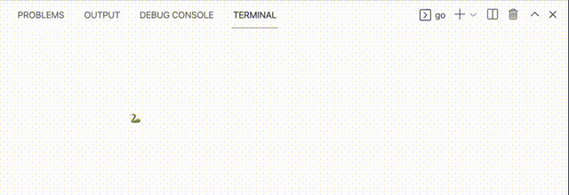

# Termbox

[Termbox](https://github.com/nsf/termbox-go) is a Go package for writing text-based interfaces.

Before using `termbox`, you must install it using the following command:

```shell
go get  "github.com/nsf/termbox-go"
```

`termbox` must be included in source code:

```golang
import "github.com/nsf/termbox-go"
```

## Termbox initialization

```golang
err := termbox.Init()
if err != nil {
  log.Fatalf("failed to init termbox: %v", err)
}
defer termbox.Close()
```

## Buffer

`termbox` has an internal buffer [CellBuffer](https://pkg.go.dev/github.com/nsf/termbox-go#CellBuffer) of type `[]Cell`, where [`Cell`](https://pkg.go.dev/github.com/nsf/termbox-go#Cell) is a struct consisting of a rune and two [attributes](https://pkg.go.dev/github.com/nsf/termbox-go#Attribute): foreground and background colors.

The buffer is synchronized with the terminal using [`Flush()`](https://pkg.go.dev/github.com/nsf/termbox-go#Flush) function.


### Updating the buffer

[func SetCell(x, y int, ch rune, fg, bg Attribute)](https://pkg.go.dev/github.com/nsf/termbox-go#SetCell) writes a character to the specific location in the buffer with a given foreground and background colors.

[func Clear(fg, bg Attribute) error](https://pkg.go.dev/github.com/nsf/termbox-go#Clear) clears the buffer and updates the default foreground and the background colors.

## Events

A `termbox` event is one of
 * mouse events (mouse button click, mouse wheel scroll),
 * keyboard events
 * terminal window resize.

 The event is defined by the [`Event`](https://pkg.go.dev/github.com/nsf/termbox-go#Event) struct.

[func PollEvent() Event](https://pkg.go.dev/github.com/nsf/termbox-go#PollEvent)
waits for an event and returns it as the `Event` struct.

## Real-time events

```golang
// Create a channel and a goroutine for receiving termbox events without
// blocking the main event loop.
eventQueue := make(chan termbox.Event)
go func() {
  for {
    eventQueue <- termbox.PollEvent()
  }
}()

// Make non-event -related logic be executed every 100ms.
ticker := time.NewTicker(100 * time.Millisecond)
defer ticker.Stop()

// Event loop.
for {
  select {
  case ev := <-eventQueue:
    if ev.Type == termbox.EventKey {
      switch ev.Key {
      case termbox.KeyArrowLeft:
        // Add what to do on Left arrow key pressed.
      case termbox.KeyArrowRight:
        // Add what to do on Right arrow key pressed.
      // Process other key presses.
      }
    }
  case <-ticker.C:
    // This block will be executed every 100ms.
   
  // default:
  // Use `default:` to add some logic on every loop iteration.
  // However, this may increase the CPU load.
  }
}
```

# Exercises

## Exercises 1

Modify `02_snake_animation` so the snake moves along the sides of a rectangle.



## Exercises 2

All exercises here must be completed by modifying `04_snake_game` program.

The game must support the following features:

1. The game field must have borders (walls). The game stops when the snake hits the border, and "Game over" message/screen is shown.
2. Apples are shown in the game field. When a snake eats an apple
   * the game score gets increased by one (the score must be shown on the screen)
   * the eaten apple dissapears and a new apple appears in a new location.
   * the snake tail grows by one.
3. The snake is not allowed to move in the opposite to the current movement direction (e.g. if the snake moves right, changing the direction to left (by pressing `←`) is forbidden).
4. The snake is not allowed to hit itself. The game stops when the snake hits its tail, and "Game over" message/screen is shown.

Extra points are given if
 * the game is visually attractive (colorful borders, a separate "Game over" screen),
 * a pull request with a solution doesn't have merge conflicts.
