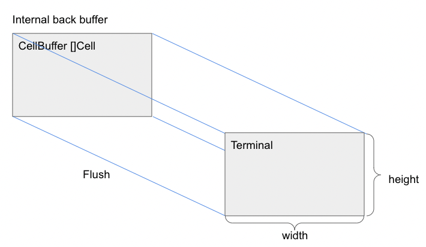

# Termbox

[Termbox](https://github.com/nsf/termbox-go) is a Go package for writing text-based interfaces.

Before using `termbox`, you must install it using the following command:

```shell
go get  "github.com/nsf/termbox-go"
```

`termbox` must be included in source code:

```golang
import "github.com/nsf/termbox-go"
```

## Termbox initialization

```golang
err := termbox.Init()
if err != nil {
  log.Fatalf("failed to init termbox: %v", err)
}
defer termbox.Close()
```

## Buffer

`termbox` has an internal buffer [CellBuffer](https://pkg.go.dev/github.com/nsf/termbox-go#CellBuffer) of type `[]Cell`, where [`Cell`](https://pkg.go.dev/github.com/nsf/termbox-go#Cell) is a struct consisting of a rune and two [attributes](https://pkg.go.dev/github.com/nsf/termbox-go#Attribute): foreground and background colors.

The buffer is synchronized with the terminal using [`Flush()`](https://pkg.go.dev/github.com/nsf/termbox-go#Flush) function.



### Updating the buffer

[func SetCell(x, y int, ch rune, fg, bg Attribute)](https://pkg.go.dev/github.com/nsf/termbox-go#SetCell) writes a character to the specific location in the buffer with a given foreground and background colors.

[func Clear(fg, bg Attribute) error](https://pkg.go.dev/github.com/nsf/termbox-go#Clear) clears the buffer and updates the default foreground and the background colors.

## Events

A `termbox` event is one of
 * mouse events (mouse button click, mouse wheel scroll),
 * keyboard events
 * terminal window resize.

 The event is defined by the [`Event`](https://pkg.go.dev/github.com/nsf/termbox-go#Event) struct.

[func PollEvent() Event](https://pkg.go.dev/github.com/nsf/termbox-go#PollEvent)
waits for an event and returns it as the `Event` struct.

## Real-time events

```golang
// Create a channel and a goroutine for receiving termbox events without
// blocking the main event loop.
eventQueue := make(chan termbox.Event)
go func() {
  for {
    eventQueue <- termbox.PollEvent()
  }
}()

// Event loop.
for {
  select {
    case ev := <-eventQueue:
      if ev.Type == termbox.EventKey {
        switch ev.Key {
        case termbox.KeyArrowLeft:
          // Add what to do on Left arrow key pressed.
        case termbox.KeyArrowRight:
          // Add what to do on Right arrow key pressed.
        // Process other key presses.
        }
      }
    default:
      // Add what to do on every step.
  }
}
```

# Exercises

All exercises must be completed by modifying `04_snake_game` program.

1. Draw the field borders (walls).
2. Collisions (alternatives):

   * The snake "bounces" back when it hits the walls.
   * Show a "Game Over" screen and quit the game when the snake hits the walls.

3. Snake tail (alternatives):

   * Add the tail with the length of 2 cells to the snake (the total snake
    length must be 3 cells).
   * Add the tail of an arbitrary length (the length is a const) to the snake.

4. Apples:

   1. Show an apple in a random position in the field. When the snake, eats an
     apple, the apple reappears in a new position.
   1. Show a score for eating the apples.
   1. Increase the tail length when the snake eats the apple.

5. Show the "Game over" screen and quit the game when the snake hits itself.
